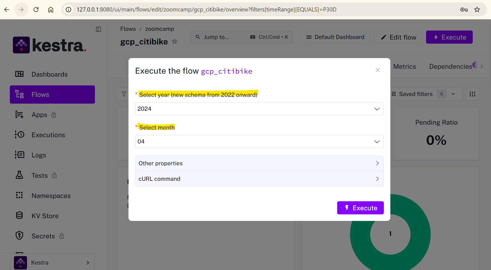
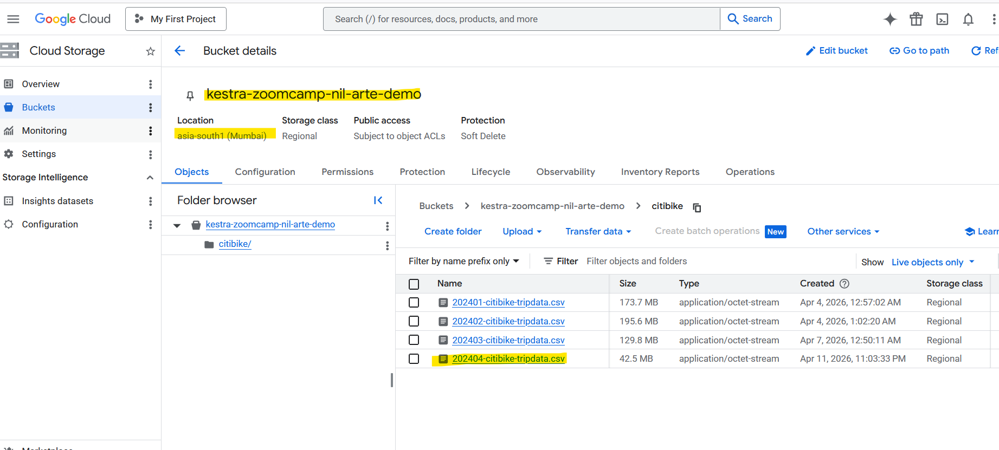
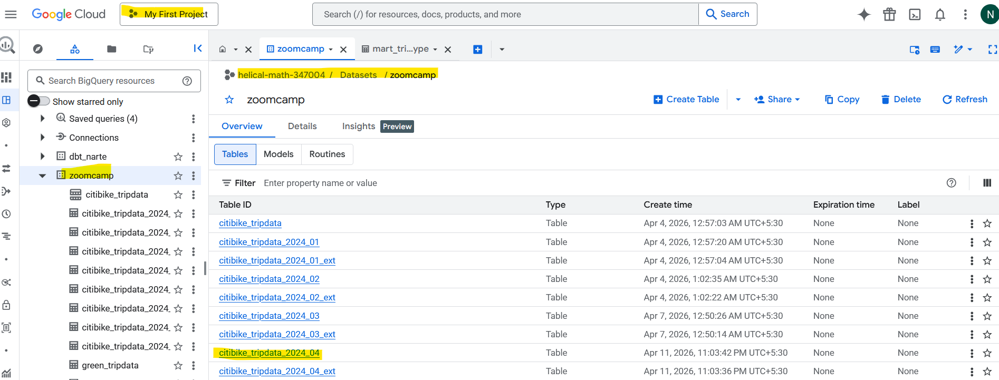

# data-engineering-zoomcamp-project-cohort-2026

## Description
This is my [DataTalksClub DE zoomcamp](https://github.com/DataTalksClub/data-engineering-zoomcamp) project repo.

Dataset credit: https://citibikenyc.com/system-data

This project uses NYC Citi Bike trip data to create an end-to-end data pipeline.

## High-level steps
- Use a Kestra pipeline to process dataset files and write raw output to a GCS data lake.
- Use a Kestra pipeline to move processed data from GCS to a BigQuery data warehouse.
- Use a dbt pipeline to transform BigQuery data for dashboard consumption.
- Build a Looker Studio dashboard to visualize the results.

## Tools used
- Cloud: GCP
- Workflow orchestration: Kestra + dbt
- Data warehouse: BigQuery
- Batch processing: Kestra

## Prerequisites
- GCP account and service account
- Docker
- dbt Cloud account

## Steps to run this data pipeline
### Local Kestra setup
1. Confirm Docker is installed and running locally.
2. From the repository root, start the local Kestra stack using Docker Compose:
   ```bash
   docker compose up -d 
   ```
3. Wait for Kestra to start. The Kestra UI should be available at:
   ```text
   http://localhost:8080/
   ```
4. Use the local admin credentials configured in `docker-compose.yaml`:
   - Username: `admin@kestra.io`
   - Password: `Admin1234!`
5. If you need to inspect logs:
   ```bash
   docker compose logs -f kestra
   ```
6. To stop the local Kestra stack:
   ```bash
   docker compose down
   ```

### Data ingestion via batch mode using Kestra
1. [Set up Google Cloud Service Account in Kestra](https://go.kestra.io/de-zoomcamp/google-sa)

2. Adjust and run the flow [gcp_kv.yaml](./gcp_kv.yaml) to include your service account, GCP project ID, BigQuery dataset and GCS bucket name (_along with their location_) as KV Store values:
- GCP_PROJECT_ID
- GCP_LOCATION
- GCP_BUCKET_NAME
- GCP_DATASET.

3. Create GCS bucket and BigQuery dataset by running the setup flow: [gcp_setup.yaml](./gcp_setup.yaml)

4. Add the flow [gcp_citibike.yaml](./gcp_citibike.yaml):
   - Select batch of data: year and month of bikes data
   - Run the flow

   

5. Verify data landed in GCS bucket:

   

6. Verify data loaded into BigQuery table:

   

### Data transformation via dbt cloud
Placeholder for the next incremental update.

### Dashboards via Looker Studio
Placeholder for the next incremental update.

