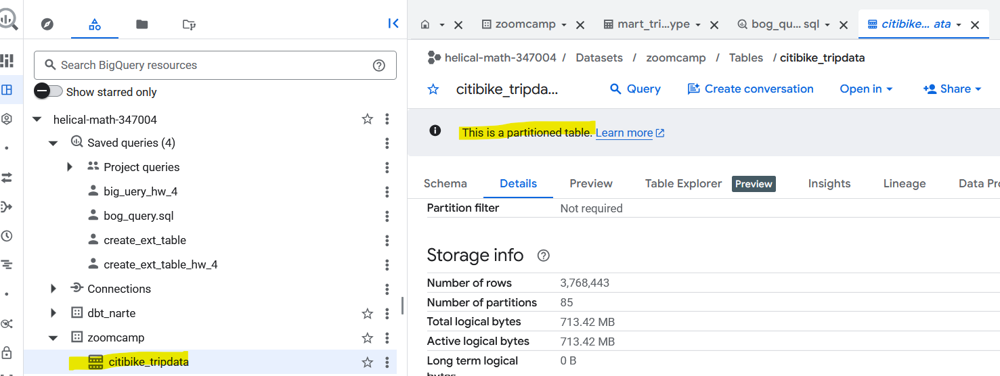
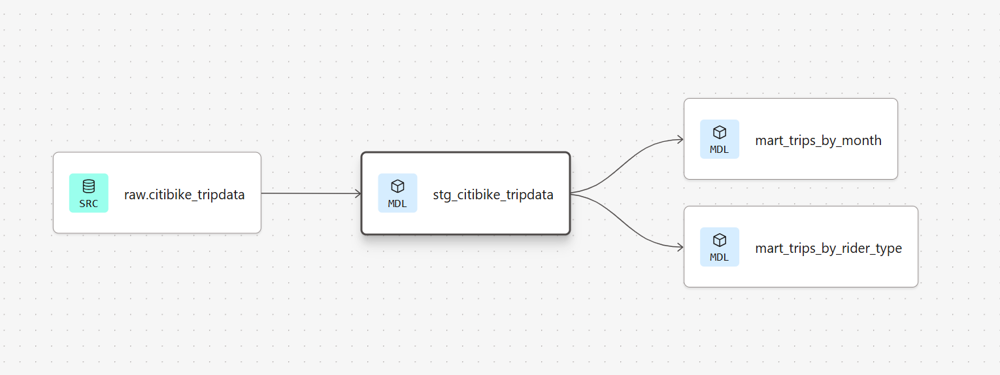
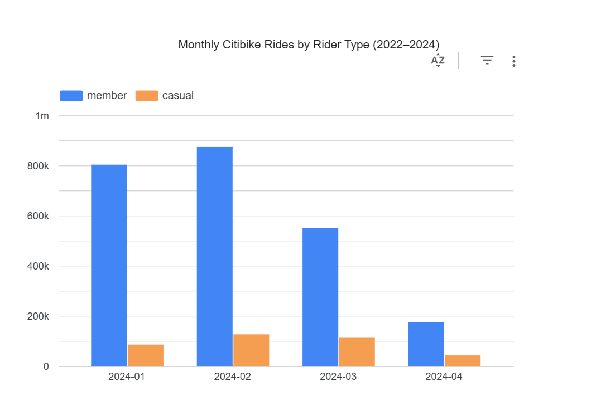
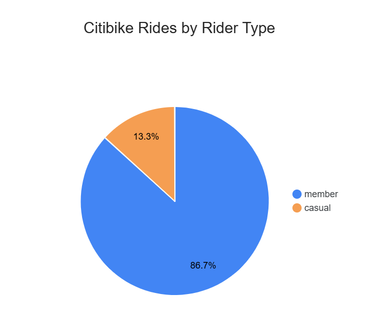

# data-engineering-zoomcamp-project-cohort-2026

## Description
This is my [DataTalksClub DE zoomcamp](https://github.com/DataTalksClub/data-engineering-zoomcamp) project repo.

Dataset credit: https://citibikenyc.com/system-data

This project uses NYC Citi Bike trip data to create an end-to-end data pipeline.

## High-level steps
- Use a Kestra pipeline to process dataset files and write raw output to a GCS data lake.
- Use a Kestra pipeline to move processed data from GCS to a BigQuery data warehouse.
- Use a dbt pipeline to transform BigQuery data for dashboard consumption.
- Build a Looker Studio dashboard to visualize the results.

## Tools used
- Cloud: GCP
- Workflow orchestration: Kestra + dbt
- Data warehouse: BigQuery
- Batch processing: Kestra

## Prerequisites
- GCP account and service account
- Docker
- dbt Cloud account

## Steps to run this data pipeline
### Local Kestra setup
1. Confirm Docker is installed and running locally.
2. From the repository root, start the local Kestra stack using Docker Compose:
   ```bash
   docker compose up -d 
   ```
3. Wait for Kestra to start. The Kestra UI should be available at:
   ```text
   http://localhost:8080/
   ```
4. Use the local admin credentials configured in `docker-compose.yaml`:
   - Username: `admin@kestra.io`
   - Password: `Admin1234!`

### Data ingestion via batch mode using Kestra
1. [Set up Google Cloud Service Account in Kestra](https://go.kestra.io/de-zoomcamp/google-sa)

2. Adjust and run the flow [gcp_kv.yaml](./gcp_kv.yaml) to include your service account, GCP project ID, BigQuery dataset and GCS bucket name (_along with their location_) as KV Store values:
- GCP_PROJECT_ID
- GCP_LOCATION
- GCP_BUCKET_NAME
- GCP_DATASET.

3. Create GCS bucket and BigQuery dataset by running the setup flow: [gcp_setup.yaml](./gcp_setup.yaml)

4. Add the flow [gcp_citibike.yaml](./gcp_citibike.yaml):
   - Select batch of data: year and month of bikes data
   - Run the flow

   

5. Verify data landed in GCS bucket:

   

6. Verify data loaded into BigQuery table:

   

7. Verify aggregated target table is partitioned
      

### Data transformation via dbt cloud
Transformations are defined in dbt Cloud, connected to this repository. The pipeline consists of two layers:

**Staging** — [`stg_citibike_tripdata`](models/staging/stg_citibike_tripdata.sql) (view)
- Reads from the raw `citibike_tripdata` BigQuery table loaded by Kestra
- Filters out invalid trips (null ride IDs, negative/zero duration, trips over 24 hours)
- Derives calculated fields: `trip_duration_minutes`, `trip_date`, `trip_year`, `trip_month`, `year_month`

**Marts** (tables)
- [`mart_trips_by_month`](models/marts/mart_trips_by_month.sql) — monthly aggregation of ride counts and average duration, partitioned by month and clustered by `member_casual` and `rideable_type`
- [`mart_trips_by_rider_type`](models/marts/mart_trips_by_rider_type.sql) — overall aggregation by rider type and bike type across all time, including % share of total rides

**Tests** are defined on all key columns (uniqueness, not_null, accepted_values).

**To run the dbt pipeline:**

1. In dbt Cloud, create a new project and link it to this repository
2. Set up a BigQuery connection and configure the following environment variable in dbt Cloud:
   - `GCP_PROJECT_ID` — your GCP project ID
3. Set the target dataset/schema to `zoomcamp` (to match the source configuration)
4. Run the full pipeline:
   ```bash
   dbt build
   ```
   This runs all models and tests in dependency order: `stg_citibike_tripdata` → `mart_trips_by_month`, `mart_trips_by_rider_type`

**Data lineage:**



### Dashboards via Looker Studio
Dashboards are built in Looker Studio on top of the dbt mart tables in BigQuery.

**Monthly Rides by Rider Type** — [View Dashboard](https://lookerstudio.google.com/reporting/75f5c844-2a5a-4414-afe0-b75505bff394)



**Rides Share by Rider Type** — [View Dashboard](https://lookerstudio.google.com/reporting/57c3846e-b1bd-4180-a524-eb789b89a2f8)



